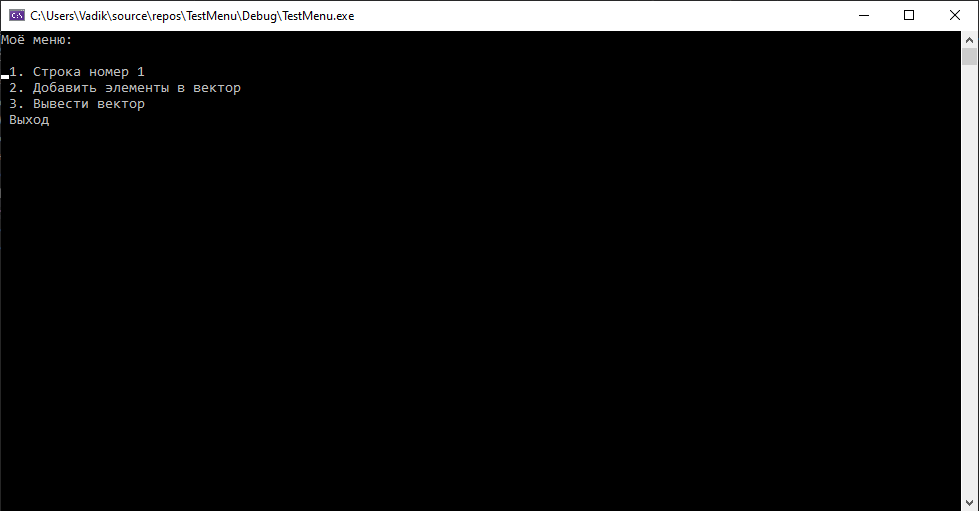

# <p align="center">Menu.h

Данная библиотека помогает очень просто создавать интерактивные меню для вашей программы.
___
## Использование
```cpp
#include <iostream>
#include "Menu.h"
#include <vector>


using namespace std;

void script(vector<int>& v);
void print_vector(vector<int> v);
void print_smth();


int main()
{
	vector<int> v;

	Menu menu("Моё меню: ");

	menu.add_row(
		" 1. Строка номер 1", print_smth
	);

	menu.add_row(
		" 2. Добавить элементы в вектор", [&]() { script(v); }
	);

	menu.add_row(
		" 3. Вывести вектор", [&]() { print_vector(v); }
	);

	menu.run();
}

void script(vector<int>& v)
{
	int n;
	int number;
	cout << "Сколько чисел: ";
	cin >> n;
	cout << "Вводите ваши числа: " << endl;
	for (size_t i = 0; i < n; i++)
	{
		cin >> number;
		v.push_back(number);
	}
}

void print_vector(vector<int> v)
{
	for (auto el: v)
		cout << el << endl;

}

void print_smth()
{
	cout << "Вы в пункте 1" << endl;
}
```

___
## Создание меню
Чтобы создать меню необходимо создать объект класса **Menu**:
```cpp
Menu menu(string title); // title -> Заголовок вашего меню, по умолчанию нет.
```

Установить по необходимости свои цвета для консоли, добавить строчки выбора:
```cpp
menu.add_row(
    string name,
    void function
);
```
Лямба функция, если необходимо передать какие-то аргументы:
```cpp
menu.add_row(
    string name,
    [&]() { function(a, b, c) }
);
```
И запустить само меню:
```cpp
menu.run();
```
## Изменение цветов консоли
Вы также можете изменить цвет текста или заднего фона консоли:
```cpp
    menu.set_colors(char BG_COLOR, char FONT_COLOR);
```
Параметры **BG_COLOR** и **FONT_COLOR** используют в качестве аргумента перечисления Colors. Доступные цвета:
+ BLUE
+ LIGHT_GREEN
+ LIGHT_AQUA
+ AQUA
+ LIGHT_RED
+ RED
+ LIGHT_PURPLE
+ PURPLE
+ LIGHT_YELLOW
+ YELLOW
+ BRIGHT_WHITE
+ WHITE
+ GRAY
+ LIGHT_BLUE
+ BLACK
